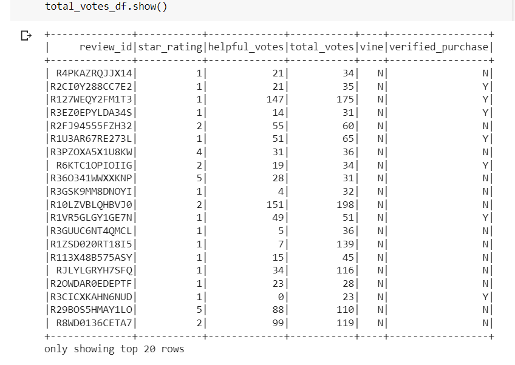
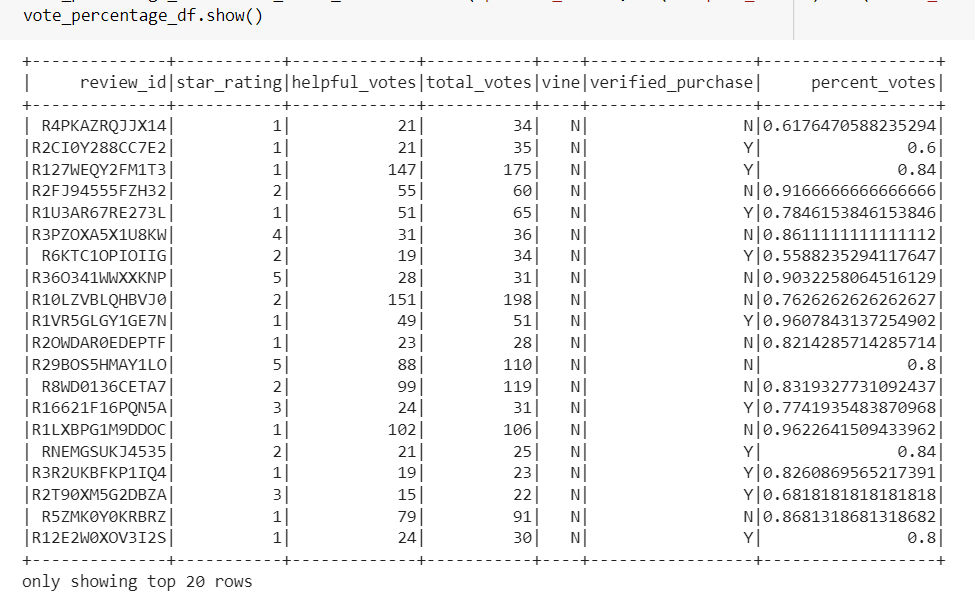

# Amazon_Vine_Analysis

## Overview
In this project, the goal is to analyze the Amazon Vine program reviews and determine if there is a bias in reviews from Vine members, versus Non-Vine members. In this analysis, PySpark is used to perform ETL processes in extracting the data and transforming the data. AWS was also used to connect to an AWS RDS instance, load that data into pgAdmin and then analyze the data from there. We also used Google Colaboratory to import PySpark libraries and connect to Postgres in order to create tables and export results.

This analysis chose to use reviews from the Video Game category.

# Results

Since the dataset for Video Game reviews is so large, we focused on the reviews that would be most helpful by filtering the dataset. We filtered the dataset by the following:
    - Count of Total Votes >= 20

    

    - Number of Helpful Votes Divided by the Number of Total Votes was >= 50%

    

# Total Number of Reviews
    - Vine Reviews: 94
    - Non-Vine Reviews: 40471
# Total Number of 5-Star Reviews
    - Vine Reviews: 48
    - Non-Vine Reviews: 15663
# Percentage of 5-Star Reviews
    - Vine Reviews: 51%
    - Non-Vine Reviews: 39%
# Summary

According to the results above, it is fair to say that Vine members did not show bias when rating their Video Games. This is because the number of 5-star ratings was or was smaller than to the amount of Non-Vine members. It can or cannot be assumed that Vine customers are or more critical when rating a review on the Amazon Video Games. However, there were overwhelminlgy more non-vine member reviews than member reviews. In order to have a more fair analysis in the future, Amazon should think about ways to getting more consumers to become a Vine member.